# NeuroStack

[](https://pypi.org/project/neurostack/)
[](https://pypi.org/project/neurostack/)
[](https://github.com/raphasouthall/neurostack/actions/workflows/ci.yml)
[](LICENSE)

**Give Claude Code and Cursor long-term memory from your Markdown vault.**

NeuroStack is a local-first MCP server that turns your Markdown vault into a searchable knowledge graph — semantic search, neuroscience-grounded memory, and prediction error tracking, all running on your machine with zero cloud dependencies.

## How it works

**Index** your vault once — FTS5, embeddings, and wiki-link graph built automatically.



**Search** by meaning, not just keywords — hybrid FTS5 + semantic scoring.



**Graph** any note — PageRank, in/out links, and neighborhood at a glance.



**Stats** — full picture of your indexed vault in one command.



**Doctor** — health check across vault, database, embeddings, and optional deps.



**Prediction errors** — surfaces notes that keep appearing in contexts where they don't fit. The signal to review and update before they mislead your AI assistant.



**Graph** — PageRank-scored neighborhood for any note. See what's central, what links where.


**Tiered retrieval** — escalates from triples (~15 tok) → summaries → full content. Pay only for the depth the query needs.



**Communities** — Leiden clustering across the wiki-link graph. Global queries synthesised from cluster summaries, not individual notes.



**Brief** — session-start summary: hot notes, drift flags, vault health in one command.



## Why NeuroStack?

Your notes are interconnected, but your tools don't know that. NeuroStack indexes your Markdown vault into a knowledge graph with:

- **Hybrid search**: FTS5 full-text + semantic embeddings find notes by meaning, not just keywords
- **Hot notes**: Active notes attract new connections, just like excitable neurons recruit new engram members
- **Drift detection**: Notes flagged when they appear in unexpected contexts — a signal to review and update
- **Community detection**: Leiden clustering reveals thematic clusters you didn't know existed
- **Tiered retrieval**: Triples (~15 tokens) → Summaries (~75 tokens) → Full content — pay only for the depth you need
- **MCP server**: Works with Claude Code, Cursor, Windsurf, or any MCP-compatible AI tool

## Quick Start

```bash
# Install (lite mode — FTS5 only, ~50MB, no GPU needed)
curl -fsSL https://raw.githubusercontent.com/raphasouthall/neurostack/main/install.sh | bash

# Or with pip
pip install neurostack

# Initialize
neurostack init ~/my-vault
neurostack index
neurostack search "how does memory consolidation work?"
```

### Full Mode (local ML)

```bash
# Install with embeddings + summaries (~500MB, requires Ollama)
NEUROSTACK_MODE=full curl -fsSL https://raw.githubusercontent.com/raphasouthall/neurostack/main/install.sh | bash

# Pull models
ollama pull nomic-embed-text
ollama pull qwen2.5:3b
```

## Features

| Feature | Lite | Full |
|---------|------|------|
| FTS5 full-text search | Yes | Yes |
| Wiki-link graph + PageRank | Yes | Yes |
| Prediction error tracking | Yes | Yes |
| Session transcript search | Yes | Yes |
| Semantic embeddings | - | Yes |
| Cross-encoder reranking | - | Yes |
| LLM summaries & triples | - | Yes |
| Leiden community detection | - | +community |

## CLI

```
neurostack init [path]          # Scaffold vault + config
neurostack index                # Index vault (FTS5 or full)
neurostack search "query"       # Hybrid search
neurostack graph "note.md"      # Wiki-link neighborhood
neurostack status               # Overview
neurostack doctor               # Health check
neurostack serve                # Start MCP server
neurostack sessions search "q"  # Search session transcripts
```

## MCP Integration

NeuroStack exposes 9 tools via the [Model Context Protocol](https://modelcontextprotocol.io):

| Tool | Purpose |
|------|---------|
| `vault_search` | Hybrid FTS5 + semantic search with tiered depth |
| `vault_summary` | Pre-computed note summary |
| `vault_graph` | Wiki-link neighborhood with PageRank |
| `vault_triples` | Structured Subject-Predicate-Object facts |
| `vault_communities` | GraphRAP global query over Leiden communities |
| `vault_stats` | Index health metrics |
| `vault_record_usage` | Track note access for hotness scoring |
| `vault_prediction_errors` | Surface notes with retrieval anomalies |
| `session_brief` | Compact session context |

### Claude Code / Cursor / Windsurf

Add to your MCP config (`~/.claude/.mcp.json` or equivalent):

```json
{
  "mcpServers": {
    "neurostack": {
      "command": "neurostack",
      "args": ["serve"],
      "env": {}
    }
  }
}
```

## Configuration

Config lives at `~/.config/neurostack/config.toml`:

```toml
vault_root = "~/brain"
embed_url = "http://localhost:11435"
llm_url = "http://localhost:11434"
llm_model = "qwen2.5:3b"
```

Every setting has a `NEUROSTACK_*` env var override.

## The Neuroscience

NeuroStack's features map to established memory neuroscience:

| Feature | Neuroscience Concept | Key Paper |
|---------|---------------------|-----------|
| Hot Notes | CREB-mediated excitability windows | Han et al. 2007, *Science* |
| Drift Detection | Prediction error-driven reconsolidation | Sinclair & Bhatt 2022, *PNAS* |
| Knowledge Graph | Engram connectivity networks | Josselyn & Tonegawa 2020, *Science* |
| Communities | Overlapping neural ensembles | Cai et al. 2016, *Nature* |
| Tiered Retrieval | Complementary learning systems | McClelland et al. 1995 |

Full citations in [docs/neuroscience-appendix.md](docs/neuroscience-appendix.md).

## Architecture

```
~/.config/neurostack/config.toml    # Configuration
~/.local/share/neurostack/
    neurostack.db                    # SQLite + FTS5 index
    sessions.db                      # Session transcript index
~/your-vault/                        # Your Markdown files (unchanged)
```

NeuroStack is **read-only** — it indexes your vault but never modifies your files.

## Requirements

- Linux · macOS (experimental)
- Python 3.11+
- SQLite with FTS5 (standard on most systems)
- **Full mode**: [Ollama](https://ollama.ai) with `nomic-embed-text` and `qwen2.5:3b`

## Links

- **Website**: [neurostack.sh](https://neurostack.sh)
- **Contact**: [hello@neurostack.sh](mailto:hello@neurostack.sh)

## License

Apache-2.0. Community detection (`neurostack[community]`) uses GPL-3.0 dependencies — isolated as an optional extra.

## Contributing

See [CONTRIBUTING.md](CONTRIBUTING.md).
